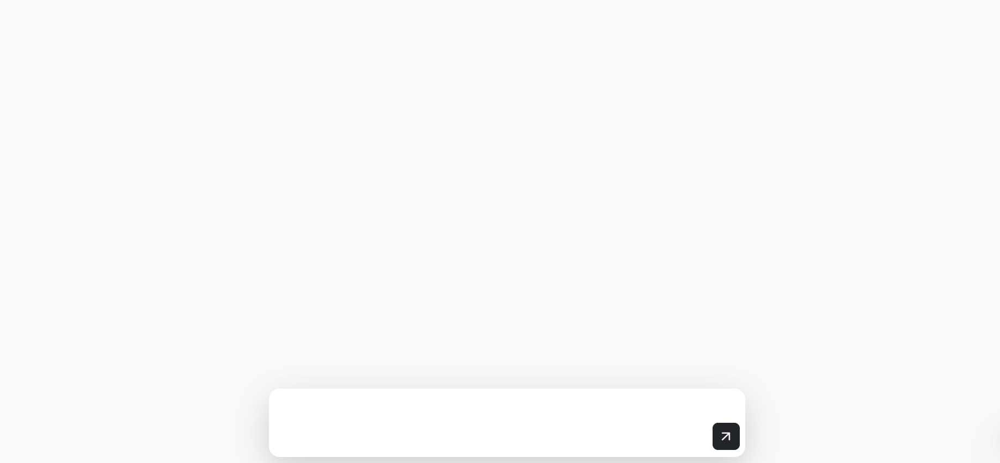
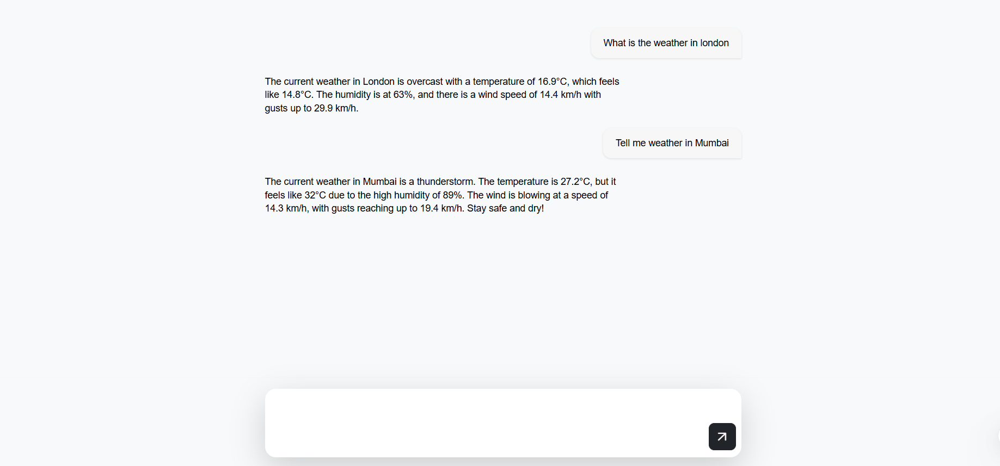

## Weather-Chat-Agent
=======
## 🌦️ Weather Chat Application

A simple **chat-based weather application** built with **React + Vite + Bootstrap**.  
Users can ask weather-related queries, and the app responds in a conversational chat interface.

---

## 🚀 Features
- 💬 **Chat UI** – user and agent messages displayed in a conversational style  
- ⌨️ **Message Input** – send messages via Enter or Send button  
- 🖼️ **Custom Send Button** – styled with a PNG arrow icon  
- 📱 **Responsive Layout** – works across devices  
- ☁️ **Weather Agent Integration** – fetches live weather data (via Mastra LLM agent API)  
-    **Text box** – Auto scroll feature
---

## 🛠️ Tech Stack
- **React (Vite)** – frontend framework  
- **Bootstrap 5** – UI styling  
- **Mastra LLM Agent API** – provides weather responses  
- **JavaScript (ES6+)**  

---

## 📂 Project Structure
├── src
│ ├── components
│ │ ├── MessageInput.jsx
│ │ ├── MessageList.jsx
│ │ ├── TypingIndicator.jsx
│ ├── hooks
│ │ ├── useWeatherChat.js
│ ├── App.jsx
│ ├── index.css
│ ├── App.css
│ └── main.jsx
├── public
│ ├── top-right.png # custom send button icon
├── .env # API keys and environment variables
├── package.json
└── README.md

---

## ⚙️ Setup Instructions

## -------------------------
## 1️⃣ INITIAL PROJECT SETUP
## -------------------------

## Clone your project (or create a new folder if not cloned yet)
git clone https://github.com/your-username/weather-chat-app.git
cd weather-chat-app

## Initialize Git (if not already done)
git init
git branch -M main

## -------------------------
## 2️⃣ INSTALL DEPENDENCIES
## -------------------------

## Install all packages listed in package.json
npm install

## -------------------------
## 3️⃣ RUN PROJECT LOCALLY
## -------------------------

## Start development server
npm run dev
## Project runs on http://localhost:5173

## -------------------------
## 4️⃣ ADD ENVIRONMENT VARIABLES
## -------------------------

## -------------------------
## 5️⃣ PUSH TO GITHUB
## -------------------------

## Add all project files
git add .

## Commit changes
git commit -m "Initial commit: Weather Chat App"

## Add your GitHub repository URL (replace with your repo link)
git remote add origin https://github.com/your-username/weather-chat-app.git

## Push to GitHub
git push -u origin main

## 📸 Screenshots

### Chat Interface



### 🚀 Run the Project

Start the development server with:

```bash
npm run dev
The app will be available at:👉 http://localhost:5173

